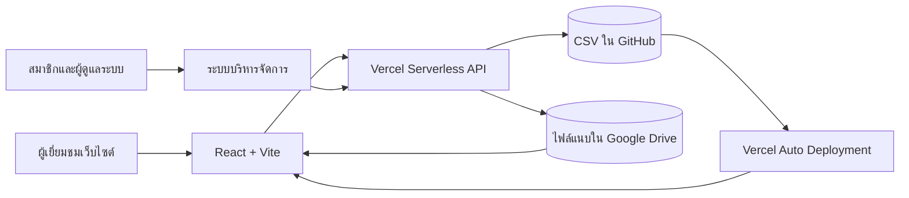

# เว็บไซต์โรงเรียนบ้านน้ำพร

<p align="center">
  
</p>

<p align="center">
  <strong>โรงเรียนบ้านน้ำพร · Bannamporn School</strong><br>
  เว็บไซต์ประชาสัมพันธ์ บริการออนไลน์ และระบบบริหารจัดการข้อมูลของโรงเรียน
</p>

<p align="center">
  <a href="https://namporn.ac.th">เว็บไซต์หลัก</a> ·
  <a href="https://www.namporn.ac.th">www.namporn.ac.th</a> ·
  <a href="https://น้ำพร.ศึกษา.ไทย">น้ำพร.ศึกษา.ไทย</a> ·
  <a href="https://github.com/boasnirut/np">GitHub</a>
</p>

## ภาพรวมระบบ

เว็บไซต์นี้พัฒนาด้วย React และ Vite ใช้ Vercel สำหรับเผยแพร่เว็บและให้บริการ Serverless API ส่วนข้อมูลที่แก้ไขผ่านระบบบริหารจัดการจะบันทึกเป็น CSV ใน GitHub repository เดียวกันผ่าน GitHub Contents API และไฟล์ที่แนบผ่านระบบบริหารจัดการจะถูกฝากไว้ที่ Google Drive ผ่าน OAuth 2.0 ของบัญชีโรงเรียน

ระบบรองรับคอมพิวเตอร์ แท็บเล็ต และโทรศัพท์มือถือ มีเมนูแบบ Dropdown, หน้าต้อนรับแบบสไลด์, Billboard Banner, ข่าวสาร ผลงาน เอกสารบริการ แบบฟอร์ม Q&A และช่องทางรับเรื่องร้องเรียน



## เมนูและหน้าสาธารณะ

### หน้าหลัก

- หน้าต้อนรับพร้อมสไลด์ภาพ `P10.jpg` และ `Q9.jpg` เลื่อนอัตโนมัติทุก 5 วินาที
- เลือก “ไม่แสดงข้อความนี้อีกวันนี้” ได้
- Billboard Banner อัตราส่วน 4:1 จากภาพ `B1.jpg`–`B4.jpg`
- สรุปข่าวสาร ปฏิทินกิจกรรม ผลงานและรางวัล และจดหมายข่าว
- รายการบนหน้าหลักใช้ Pagination เพื่อลดความยาวของหน้า
- Floating Action Button สำหรับโทรศัพท์ อีเมล Messenger และ Facebook

### เกี่ยวกับโรงเรียน

- ข้อมูลพื้นฐานและสถิตินักเรียนรายชั้น
- แดชบอร์ดจำนวนครูและบุคลากร
- ข้อมูลบุคลากรพร้อมภาพอัตราส่วน 4:3
- ประวัติโรงเรียน

### ผลงานและรางวัล

แบ่งรายการเป็น 4 ประเภท:

1. ผลงาน/รางวัลโรงเรียน
2. ผลงาน/รางวัลผู้บริหาร ครู และบุคลากร
3. ผลงาน/รางวัลนักเรียน
4. Best Practice/นวัตกรรม/วิจัยชั้นเรียน สำหรับครูเผยแพร่ผลงานของตนเอง

ผู้เยี่ยมชมสามารถเปิดดูภาพขนาดเต็ม รายละเอียด ผู้รับรางวัล ระดับรางวัล และเอกสารประกอบได้

### การดำเนินงาน

- การสอบวัดผลระดับชาติ
- ประกันคุณภาพภายนอก (สมศ.) รอบที่ 5
- โรงเรียนขยายโอกาสคุณภาพ
- ITA Online

หน้าประกันคุณภาพภายนอกแบ่งหลักฐานเป็นระดับปฐมวัยและระดับการศึกษาขั้นพื้นฐานตามมาตรฐานและตัวชี้วัด โดยเชื่อมเอกสารที่บันทึกจากระบบบริหารจัดการ หากหลักฐานเป็นรูปภาพ ระบบจะแสดงภาพตัวอย่างในตัวชี้วัดและเปิดดูภาพเต็มได้ พร้อมซูม เลื่อนภาพ และเปลี่ยนภาพก่อนหน้า/ถัดไป ส่วนหลักฐาน PDF จะแสดงตัวอย่างและเปิดอ่านแบบเต็มหน้าจอภายในเว็บไซต์ พร้อมเครื่องมือซูม เลื่อนหน้า และปุ่มเปิดไฟล์ต้นฉบับ

### ข่าวสาร

- กิจกรรม
- ประชาสัมพันธ์
- ประกาศ
- จดหมายข่าว

หน้าหมวดข่าวแสดงรายการทั้งหมด ส่วนหน้าหลักแสดงเฉพาะจำนวนที่เหมาะสมพร้อม Pagination รายการจะเรียงตามวันที่เผยแพร่จากล่าสุดไปเก่าสุด และใช้เลขลำดับการแสดงผลเมื่อเป็นวันเดียวกัน

### บริการ

- ตรวจสอบผลการเรียน
- ดาวน์โหลดเอกสารและแบบคำร้องจาก Google Drive
- ถาม-ตอบ (Q&A)
- แจ้งเรื่องร้องเรียน

เอกสารและแบบคำร้องแสดงในรูปแบบตาราง แยกประเภท และมีปุ่มเปิดหรือดาวน์โหลดเอกสาร โดยระบบจัดเก็บเฉพาะลิงก์ Google Drive/Google Docs ไม่อัปโหลดไฟล์เอกสารเข้า GitHub

### ติดต่อเรา

แสดงที่อยู่ หมายเลขโทรศัพท์ อีเมล Facebook Messenger และแผนที่โรงเรียน

## ระบบสมาชิกและระบบบริหารจัดการ

เข้าใช้งานที่ [`/login`](https://namporn.ac.th/login) และจัดการข้อมูลที่ [`/admin`](https://namporn.ac.th/admin)

### การสมัครและอนุมัติสมาชิก

- ผู้ใช้ทั่วไปสามารถสมัครสมาชิกได้
- บัญชีใหม่มีสถานะ `pending` และยังเข้าใช้งานไม่ได้
- ผู้ดูแลระบบเป็นผู้อนุมัติ ระงับ หรือเปิดใช้งานบัญชี
- ผู้ดูแลระบบแก้ไขชื่อผู้ใช้ ชื่อที่แสดง บทบาท และรีเซ็ตรหัสผ่านได้
- ผู้ดูแลระบบลบสมาชิกออกจากระบบได้ โดยไม่สามารถลบบัญชีตนเองหรือผู้ดูแลระบบคนสุดท้าย
- การแก้ไขข้อมูลสมาชิกทำผ่านหน้าต่าง Popup ที่รองรับการเลื่อนบนจอขนาดเล็ก
- สามารถเปลี่ยนสมาชิกเป็นผู้ดูแลระบบได้ โดยระบบป้องกันไม่ให้ลบสิทธิ์ผู้ดูแลระบบคนสุดท้าย

### สิทธิ์ที่กำหนดให้สมาชิกได้

ผู้ดูแลระบบสามารถกำหนดสิทธิ์แยกเป็นรายบุคคล:

| รหัสสิทธิ์ | ส่วนที่จัดการ |
|---|---|
| `news` | ข่าวสาร กิจกรรมข่าว ประชาสัมพันธ์ และประกาศ |
| `events` | ปฏิทินกิจกรรม |
| `awards` | ผลงานและรางวัล |
| `newsletters` | จดหมายข่าวประชาสัมพันธ์ |
| `quality` | หลักฐานงานประกันคุณภาพภายนอก (สมศ.) |
| `documents` | เอกสารและแบบคำร้อง |
| `qa` | ตอบคำถามจาก Q&A |
| `complaints` | ตรวจสอบและอัปเดตสถานะเรื่องร้องเรียน |

ผู้ดูแลระบบมีสิทธิ์ทุกส่วนโดยอัตโนมัติ รวมถึงการจัดการสมาชิก การแก้ไข/ลบรายการ การกำหนดลำดับ และการเลือกเผยแพร่ Q&A

### ความสามารถในการจัดการเนื้อหา

- ข่าวสาร: หัวข้อ หมวดหมู่ วันที่ สรุป รายละเอียด รูปภาพ และไฟล์/ลิงก์แนบ
- ปฏิทินกิจกรรม: ชื่อ วันที่ เวลา สถานที่ รายละเอียด และไฟล์/ลิงก์แนบ
- ผลงานและรางวัล: ประเภท วันที่ ผู้ได้รับ ระดับ รายละเอียด รูปภาพ และไฟล์/ลิงก์แนบ รวมหมวด Best Practice/นวัตกรรม/วิจัยชั้นเรียน
- จดหมายข่าว: หมายเลขฉบับ วันที่ ภาพแนวตั้งอัตราส่วนประมาณ 1:1.4 และไฟล์/ลิงก์แนบ
- หลักฐาน สมศ.: ระดับการศึกษา ตัวชี้วัด รายละเอียด และหลักฐานสูงสุด 5 รายการ
- เอกสารและแบบคำร้อง: ชื่อ ประเภท วันที่ รายละเอียด และไฟล์/ลิงก์แนบ
- Q&A: ตอบคำถามและเลือกแสดง/ซ่อนคำถามบนเว็บไซต์
- เรื่องร้องเรียน: ตรวจข้อมูลหลักฐาน อัปเดตสถานะ และบันทึกหมายเหตุภายใน

แต่ละรายการในส่วนข่าวสาร ปฏิทินกิจกรรม ผลงานและรางวัล จดหมายข่าว เอกสาร/แบบคำร้อง และหลักฐาน สมศ. แนบไฟล์หรือลิงก์ HTTPS รวมกันได้สูงสุด 5 รายการ ไฟล์ที่อัปโหลดรองรับทุกประเภทและมีขนาดได้ไม่เกิน 100 MB ต่อไฟล์ ส่วนรูปภาพหน้าปกข่าว ผลงาน และจดหมายข่าวรองรับ JPG, PNG และ WebP

### การอัปโหลดไฟล์ไป Google Drive

ระบบใช้ Google Drive API แบบ OAuth 2.0 และ Refresh Token สำหรับไฟล์ที่เลือกอัปโหลดจากหน้าบริหารจัดการ ได้แก่:

- รูปภาพข่าวสาร
- รูปภาพผลงานและรางวัล
- รูปภาพจดหมายข่าวประชาสัมพันธ์
- ไฟล์แนบข่าวสาร ปฏิทินกิจกรรม ผลงานและรางวัล จดหมายข่าว และเอกสาร/แบบคำร้อง
- ไฟล์หลักฐานงานประกันคุณภาพ (สมศ.)

เมื่อกดบันทึก API จะใช้ Refresh Token ขอ Access Token ใหม่โดยอัตโนมัติ จากนั้นค้นหาหรือสร้างโฟลเดอร์ `Bannamporn Website Uploads` ใน My Drive ของบัญชีที่อนุญาต ตั้งค่าสิทธิ์ไฟล์เป็นเปิดดูผ่านลิงก์ได้ แล้วบันทึก URL ของไฟล์ลง CSV ใน GitHub แทนการเก็บไฟล์จริงใน repository ระบบใช้ scope `drive.file` เพื่อเข้าถึงเฉพาะไฟล์และโฟลเดอร์ที่เว็บไซต์สร้างขึ้น

การอัปโหลดใช้ Google Drive Resumable Upload โดย Vercel ตรวจสอบ session สิทธิ์ ประเภทไฟล์ และขนาดก่อนสร้าง upload session จากนั้นเบราว์เซอร์ส่งเนื้อไฟล์ตรงไปยัง Google Drive จึงรองรับไฟล์สูงสุด 100 MB โดยไม่ติดเพดาน request body 4.5 MB ของ Vercel Function เมื่ออัปโหลดเสร็จ Vercel จะตรวจสอบเจ้าของ upload session ตั้งค่าสิทธิ์เปิดดูผ่านลิงก์ และบันทึก URL ลงฐานข้อมูล

## การจัดเรียงและการเผยแพร่ข้อมูล

- ข่าว จดหมายข่าว เอกสาร และผลงานเรียงตามวันที่เผยแพร่/วันที่ได้รับจากล่าสุดไปเก่าสุด
- หากวันที่ตรงกัน ระบบใช้ `display_order` จากค่ามากไปน้อย
- เลขลำดับนับแยกเฉพาะรายการในวันเดียวกัน
- รายการสถานะ `draft` จะไม่ถูกส่งไปแสดงในหน้าสาธารณะ
- ระบบแสดงชื่อผู้บันทึกและชื่อผู้แก้ไขในหน้าบริหารจัดการ
- เมื่อบันทึกข้อมูล API จะสร้าง commit ใน branch ที่กำหนด และ Vercel จะนำ commit ล่าสุดไปเผยแพร่โดยอัตโนมัติ

## Q&A และเรื่องร้องเรียน

### Q&A

1. ผู้เยี่ยมชมกรอกชื่อ อีเมลสำหรับติดต่อกลับ (ไม่บังคับ) และคำถาม
2. คำถามเข้าสู่ระบบบริหารในสถานะรอตอบ
3. สมาชิกที่มีสิทธิ์ `qa` สามารถบันทึกคำตอบได้
4. ผู้ดูแลระบบเลือกได้ว่าจะเผยแพร่หรือซ่อนคำถามชุดนั้น
5. หน้าเว็บไซต์แสดงเฉพาะคำถามที่ตอบแล้วและได้รับอนุญาตให้เผยแพร่

### เรื่องร้องเรียน

1. ผู้แจ้งกรอกชื่อ ช่องทางติดต่อ หัวข้อ และรายละเอียด
2. แนบลิงก์ HTTPS ของรูปภาพหรือเอกสารหลักฐานได้สูงสุด 5 ลิงก์
3. ระบบไม่รับไฟล์อัปโหลดจากแบบฟอร์มร้องเรียน เพื่อประหยัดพื้นที่ GitHub
4. ผู้มีสิทธิ์ `complaints` ตรวจสอบเรื่อง เปลี่ยนสถานะ และบันทึกหมายเหตุภายในได้
5. เฉพาะผู้ดูแลระบบเท่านั้นที่ลบรายการได้

ข้อมูลส่วนตัวและลิงก์หลักฐานของเรื่องร้องเรียนถูกเข้ารหัสด้วย AES-256-GCM ก่อนบันทึกลง CSV เนื่องจาก repository นี้เป็นแบบสาธารณะ การถอดรหัสเกิดขึ้นเฉพาะใน Serverless API ที่มี `COMPLAINTS_ENCRYPTION_KEY`

> [!IMPORTANT]
> ห้ามเปลี่ยนหรือลบ `COMPLAINTS_ENCRYPTION_KEY` หลังเริ่มรับเรื่องร้องเรียน เพราะข้อมูลเดิมจะไม่สามารถถอดรหัสได้ ควรเก็บสำรองคีย์ไว้ในระบบจัดการความลับที่ปลอดภัย

## โครงสร้างข้อมูล

| ไฟล์ | ข้อมูล |
|---|---|
| `data/users.csv` | บัญชี บทบาท สถานะ และสิทธิ์สมาชิก |
| `data/news.csv` | ข่าวกิจกรรม ประชาสัมพันธ์ และประกาศ |
| `data/events.csv` | ปฏิทินกิจกรรม |
| `data/awards.csv` | ผลงานและรางวัล |
| `data/newsletters.csv` | จดหมายข่าวประชาสัมพันธ์ |
| `data/quality-evidence.csv` | หลักฐานตามตัวชี้วัด สมศ. |
| `data/school-documents.csv` | ลิงก์เอกสารและแบบคำร้อง |
| `data/questions.csv` | คำถาม คำตอบ และสถานะการเผยแพร่ |
| `data/complaints.csv` | เรื่องร้องเรียนที่เข้ารหัสและสถานะดำเนินงาน |

ไฟล์สื่อใหม่ที่อัปโหลดผ่านระบบบริหารจัดการจะถูกฝากไว้ใน Google Drive และเก็บเฉพาะ URL ไว้ใน CSV ส่วนไฟล์เก่าบางรายการอาจยังอ้างอิง URL จาก `public/uploads/<ประเภท>/` บน GitHub ได้ตามข้อมูลเดิม

> [!CAUTION]
> Repository เป็นสาธารณะ จึงไม่ควรกรอกข้อมูลส่วนบุคคลหรือข้อมูลลับในข่าว เอกสารทั่วไป และ Q&A ข้อมูลร้องเรียนเป็นส่วนเดียวที่เข้ารหัสก่อนบันทึก

## เทคโนโลยีที่ใช้

- React 18
- Vite 6
- Lucide React
- CSS แบบ Responsive
- Vercel Hosting และ Serverless Functions
- GitHub Contents API
- Google Drive API ผ่าน OAuth 2.0 และ Refresh Token
- CSV เป็นแหล่งข้อมูลหลัก
- HMAC-SHA256 สำหรับ session และ `scrypt` สำหรับรหัสผ่านสมาชิก
- AES-256-GCM สำหรับข้อมูลร้องเรียน

## โครงสร้างโครงการ

```text
.
├── api/
│   ├── _lib/              # ฟังก์ชันร่วม การยืนยันตัวตน CSV GitHub และการเข้ารหัส
│   ├── auth/              # เข้าสู่ระบบ ออกจากระบบ สมัคร และตรวจ session
│   ├── services.js        # API กลางสำหรับเอกสาร Q&A และเรื่องร้องเรียน
│   └── *.js               # API ข่าว กิจกรรม รางวัล สมาชิก และหลักฐาน
├── data/                  # ฐานข้อมูล CSV
├── public/
│   ├── uploads/           # รูปภาพและเอกสารที่ระบบบริหารอัปโหลด
│   └── ...                # โลโก้ ภาพบุคลากร และภาพประกอบ
├── src/
│   ├── AdminPortal.jsx    # ระบบบริหารจัดการ
│   ├── App.jsx            # หน้าเว็บไซต์และ Routing
│   ├── content.js         # เมนูและข้อมูลคงที่
│   ├── qualityStandards.js
│   ├── admin.css
│   └── styles.css
├── vercel.json
└── package.json
```

## ตัวแปรสภาพแวดล้อม

กำหนดค่าต่อไปนี้ใน Vercel Project Settings → Environment Variables:

| ตัวแปร | จำเป็น | คำอธิบาย |
|---|---:|---|
| `AUTH_SECRET` | ใช่ | คีย์ยาวแบบสุ่มสำหรับลงนาม session และใช้ร่วมกับการแฮชรหัสผ่าน |
| `ADMIN_PASSWORD` | ใช่ | รหัสผ่านเริ่มต้นของบัญชีผู้ดูแลที่ใช้ค่า `ENV` ใน `data/users.csv` |
| `GITHUB_TOKEN` | ใช่ | Fine-grained PAT ที่มีสิทธิ์อ่านและเขียน Contents ของ repository |
| `GITHUB_OWNER` | ไม่บังคับ | ค่าเริ่มต้น `boasnirut` |
| `GITHUB_REPO` | ไม่บังคับ | ค่าเริ่มต้น `np` |
| `GITHUB_BRANCH` | ไม่บังคับ | ค่าเริ่มต้น `main` |
| `GOOGLE_OAUTH_CLIENT_ID` | ใช่ | Client ID ของ OAuth 2.0 Client ชนิด Web application |
| `GOOGLE_OAUTH_CLIENT_SECRET` | ใช่ | Client Secret ของ OAuth 2.0 Client โดยเก็บเป็นค่า secret ใน Vercel |
| `GOOGLE_OAUTH_REFRESH_TOKEN` | ใช่ | Refresh Token ที่อนุญาต scope `drive.file` โดยเก็บเป็นค่า secret ใน Vercel |
| `GOOGLE_DRIVE_FOLDER_NAME` | ไม่บังคับ | ชื่อโฟลเดอร์ที่ระบบสร้างใน My Drive ค่าเริ่มต้น `Bannamporn Website Uploads` |
| `COMPLAINTS_ENCRYPTION_KEY` | ใช่ | คีย์ลับถาวรสำหรับเข้ารหัสและถอดรหัสเรื่องร้องเรียน |

ตัวอย่างสำหรับการพัฒนาอยู่ใน `.env.example` ห้าม commit ค่า secret จริงลง GitHub

### การตั้งค่า Google Drive OAuth 2.0

1. เข้า Google Cloud Console แล้วสร้าง Project สำหรับเว็บไซต์โรงเรียน
2. เปิดใช้งาน Google Drive API
3. ตั้งค่า OAuth consent screen และเพิ่ม scope `https://www.googleapis.com/auth/drive.file`
4. สร้าง OAuth Client ID ชนิด **Web application** และเพิ่ม Authorized redirect URI เป็น `https://developers.google.com/oauthplayground`
5. เปิด [OAuth 2.0 Playground](https://developers.google.com/oauthplayground/) กดรูปเฟือง เปิด **Use your own OAuth credentials** แล้วกรอก Client ID และ Client Secret
6. กำหนด Access type เป็น **Offline** และ Force prompt เป็น **Consent Screen**
7. ใส่ scope `https://www.googleapis.com/auth/drive.file` แล้วกด **Authorize APIs** ด้วยบัญชี Google Drive ที่ต้องการใช้พื้นที่จัดเก็บ
8. กด **Exchange authorization code for tokens** แล้วคัดลอก Refresh Token
9. เพิ่มค่า `GOOGLE_OAUTH_CLIENT_ID`, `GOOGLE_OAUTH_CLIENT_SECRET` และ `GOOGLE_OAUTH_REFRESH_TOKEN` ใน Vercel Project Settings → Environment Variables
10. Redeploy เว็บไซต์เพื่อให้ Serverless API อ่านค่าใหม่ การอัปโหลดครั้งแรกจะสร้างโฟลเดอร์ `Bannamporn Website Uploads` ใน My Drive ให้อัตโนมัติ

Client Secret และ Refresh Token เป็นข้อมูลลับ ห้ามใส่ในโค้ด ห้าม commit ลง GitHub และห้ามส่งผ่านแชต หลังได้รับ Refresh Token แล้วสามารถนำ redirect URI ของ OAuth Playground ออกจาก OAuth Client ได้

### สิทธิ์ GitHub Token ขั้นต่ำ

สร้าง Fine-grained personal access token โดยเลือกเฉพาะ repository `boasnirut/np` และกำหนด:

- Repository permissions → Contents: **Read and write**
- Metadata: **Read-only** ซึ่ง GitHub กำหนดให้อัตโนมัติ

ควรกำหนดวันหมดอายุ หมุนเวียน token เป็นระยะ และบันทึก token เฉพาะใน Vercel Environment Variables

## เริ่มพัฒนาในเครื่อง

ต้องติดตั้ง Node.js รุ่นปัจจุบันแบบ LTS

```bash
git clone https://github.com/boasnirut/np.git
cd np
npm install
```

สร้าง `.env.local` จาก `.env.example` และใส่ค่าทดสอบของตนเอง

### เปิดเฉพาะหน้าเว็บ

```bash
npm run dev
```

เปิด `http://localhost:5173` วิธีนี้เหมาะกับการปรับหน้าตา แต่ Serverless API จะไม่ทำงานครบถ้วน

### เปิดทั้งหน้าเว็บและ API

```bash
npx vercel dev
```

Vercel CLI จะจำลอง Routing, Environment Variables และ Serverless API ใกล้เคียงกับระบบออนไลน์

## ตรวจสอบคุณภาพก่อนเผยแพร่

```bash
npm run lint
npm run build
npm run preview
```

- `npm run lint` ตรวจรูปแบบและข้อผิดพลาดของ JavaScript/React
- `npm run build` สร้าง Production Bundle ใน `dist/`
- `npm run preview` เปิดดูผลลัพธ์ Production ในเครื่อง

## การเผยแพร่ด้วย GitHub และ Vercel

1. เชื่อม repository `boasnirut/np` กับ Vercel
2. ตั้งค่า Environment Variables สำหรับ Production
3. กำหนด Build Command เป็น `npm run build`
4. กำหนด Output Directory เป็น `dist`
5. Push หรือบันทึกข้อมูลเข้าสู่ branch `main`
6. Vercel จะ Deploy commit ใหม่โดยอัตโนมัติ

เส้นทาง `/login`, `/register`, `/admin`, `/about/*`, `/operations/*`, `/news/*`, `/services/*`, `/achievements` และ `/contact` ถูก Rewrite ไปยัง `index.html` ใน `vercel.json` เพื่อรองรับ Client-side Routing

## โดเมนที่ใช้งาน

- [namporn.ac.th](https://namporn.ac.th)
- [www.namporn.ac.th](https://www.namporn.ac.th)
- [น้ำพร.ศึกษา.ไทย](https://น้ำพร.ศึกษา.ไทย)

ทั้งสามโดเมนเชื่อมกับ Production Deployment ของโครงการบน Vercel

## ข้อมูลโรงเรียน

โรงเรียนบ้านน้ำพร (Bannamporn School) เปิดสอนตั้งแต่ชั้นอนุบาล 2 ถึงมัธยมศึกษาปีที่ 3 เป็นโรงเรียนขยายโอกาส สังกัดสำนักงานเขตพื้นที่การศึกษาประถมศึกษาเลย เขต 1

ที่อยู่: 115 หมู่ 2 บ้านน้ำพร ตำบลปากตม อำเภอเชียงคาน จังหวัดเลย 42110

- โทรศัพท์: 06-2546-1959
- อีเมล: numporn@loei1.go.th
- Facebook: [NampornSchool](https://www.facebook.com/NampornSchool/)
- แผนที่: [Google Maps](https://maps.app.goo.gl/ZTXbKacBqoMYUu4Q8)
